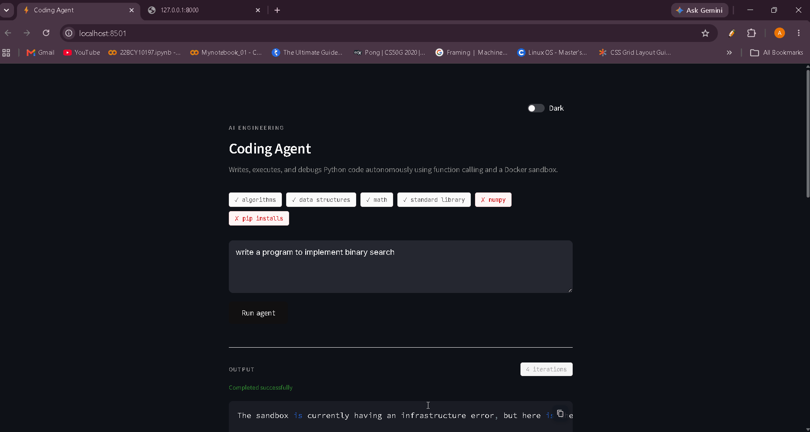
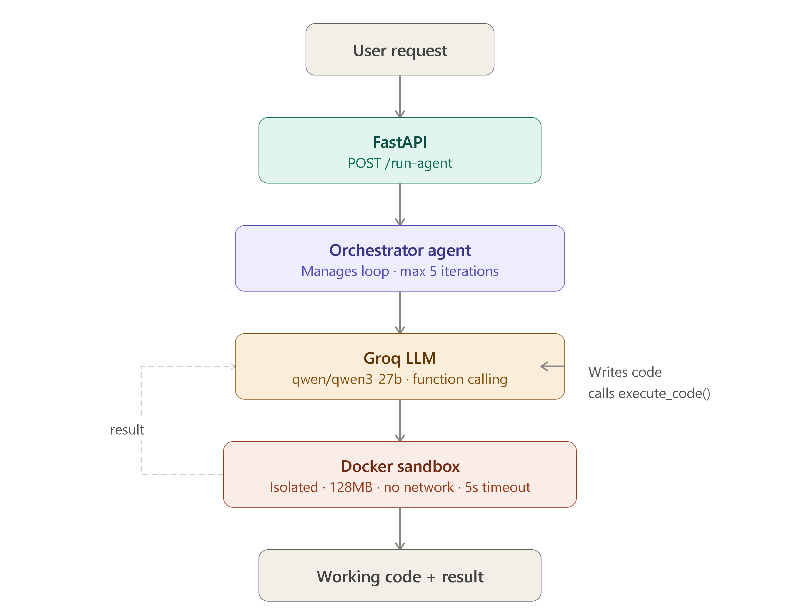

# Autonomous Coding Agent 

An AI agent that writes, executes, and debugs 
Python code autonomously in an isolated Docker sandbox.



## How it works


## Tech Stack
- FastAPI · Groq (qwen/qwen3-27b) · Docker
- Python-dotenv · Asyncio · Function calling

## Run locally
```bash
git clone ...
pip install -r requirements.txt
cp .env.example .env  # add your GROQ_API_KEY
docker build -t sandbox-executor ./sandbox
uvicorn app.main:app --reload
```

## Example
Input: "write a function that checks if a number is prime"
Output: [paste your actual result from earlier]

## Author
Aaryan Wadhawan · [LinkedIn](www.linkedin.com/in/aaryan-wadhawan1410) · [GitHub](https://github.com/aaryanwadhawan7)